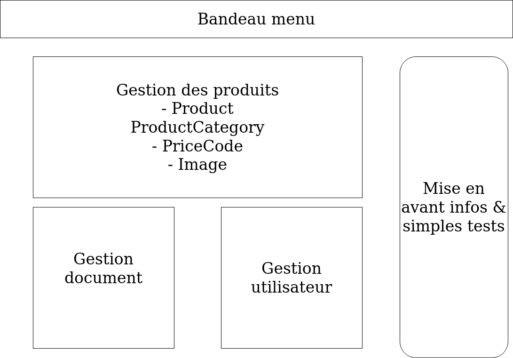

# Administration

## Généralités

* partie admin splittée en 2
  + partie ER classique simplifiée
    - suppression chargement fichiers
    - chargement en tables
    - meilleure mise en avant de certaines "stats"
  + partie bdd/api
    - tests
    - FormType
    - kmlReader pour chargement KML par série
* suppression de sonata

## Interface

